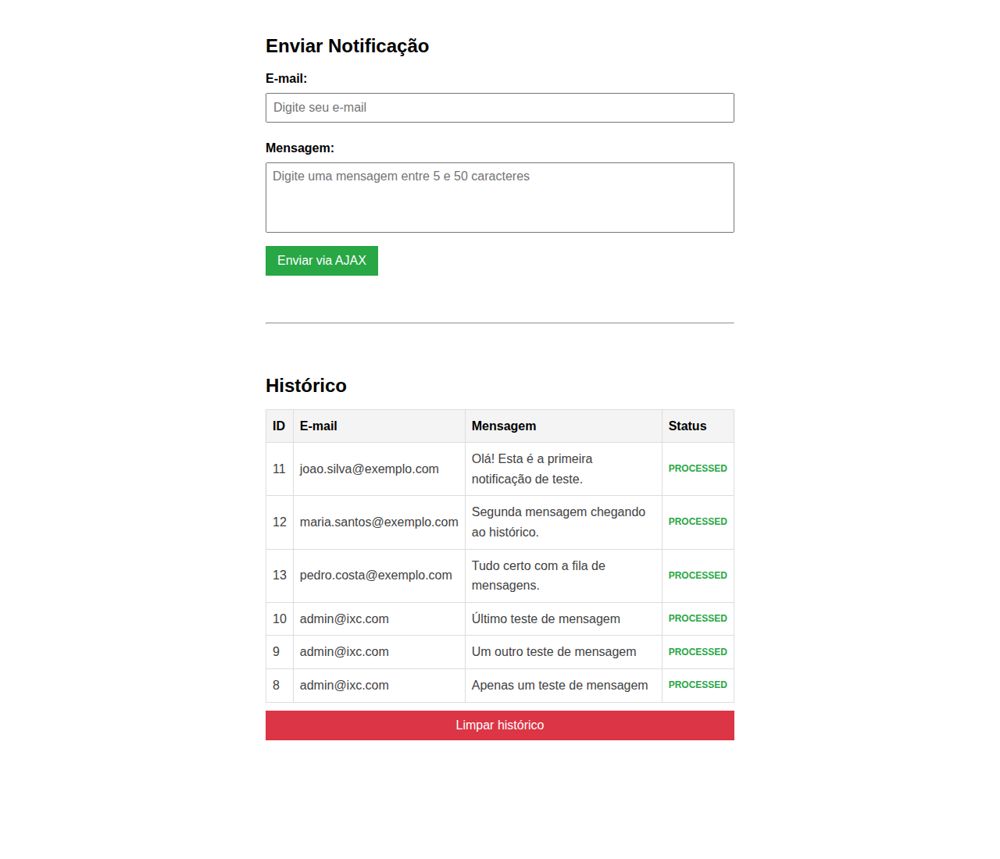

# Notefyer

Sistema de notificações assíncronas com fila de mensagens. Permite enviar notificações (e-mail + mensagem) através de uma interface web, que são persistidas no banco de dados e processadas de forma assíncrona via RabbitMQ.

**Funcionalidades:**
- Envio de notificações via formulário web com AJAX (sem recarregar a página)
- Validação client-side: **e-mail obrigatório** e mensagem entre **6 e 50 caracteres**
- Persistência em MariaDB com transição automática de status `PENDING` → `PROCESSED`
- Processamento assíncrono via fila do RabbitMQ (consumida por `consumer.php`)
- Histórico de notificações exibido em tempo real
- Botão para limpar todo o histórico, exibido apenas quando há notificações
- **Cache de leitura com Memcached** (TTL de 5s, invalidado em qualquer `POST` ou `DELETE`)



## Visão Geral da Arquitetura

```
┌────────────┐     POST /api.php      ┌──────────────┐    publish     ┌───────────┐
│  Frontend  │ ─────────────────────▸ │   PHP-FPM    │ ────────────▸  │  RabbitMQ │
│ (HTML/JS)  │ ◂────── JSON ───────── │   (API)      │                │  (Fila)   │
└────────────┘     POST/GET/DELETE    └─┬──────────┬─┘                └─────┬─────┘
                                        │ cache    │ invalidate             │ consume
                                        │ lookup   │ on POST/DEL            ▼
                                   ┌────┴───────┐  │                 ┌──────────────┐
                                   │ Memcached  │◂─┘                 │   Consumer   │
                                   │  (5s TTL)  │                    │  (PHP CLI)   │
                                   └─────┬──────┘                    └──────┬───────┘
                                         │ cache miss                       │ UPDATE
                                         │ (INSERT no POST,                 │
                                         │  SELECT no GET miss)             ▼
                                         ▼                              ┌─────────┐
                                   ┌───────────────────────────────┐    │ MariaDB │
                                   │     MariaDB   (MySQL)         │──► │ (state) │
                                   └───────────────────────────────┘    └─────────┘
```

### Fluxo de uma notificação

1. O usuário preenche o formulário com **e-mail** e **mensagem** e clica em "Enviar".
2. O frontend envia uma requisição `POST` para `/api.php` com os dados em JSON.
3. A API insere a notificação no banco MariaDB com status `PENDING` e publica a mensagem na fila do RabbitMQ.
4. O **consumer** (`consumer.php`) consome a mensagem da fila, simula o processamento e atualiza o status para `PROCESSED` no banco de dados.
5. O frontend lista o histórico de notificações via `GET /api.php`. **A leitura passa por um cache Memcached com TTL de 5 s** — em cache miss a API faz `SELECT` no MariaDB e popula o cache; em cache hit, retorna imediatamente. Toda notificação criada via `POST` ou removida via `DELETE` invalida o cache, então o histórico sempre reflete o estado mais recente logo após uma ação do usuário.

## Stack Tecnológica

| Camada       | Tecnologia            |
|--------------|-----------------------|
| Frontend     | HTML, CSS, JavaScript (vanilla) |
| Backend      | PHP 7.4 (FPM)        |
| Servidor Web | Nginx (Alpine)       |
| Banco de Dados | MariaDB 10.5       |
| Fila de Mensagens | RabbitMQ 3 (com Management UI) |
| Cache de Leitura | Memcached 1.6 (Alpine) |
| Cliente PHP do Cache | Extensão `memcached-3.2.0` via PECL |
| Dependências PHP | php-amqplib ^3.7  |
| Containerização | Docker + Docker Compose |

## Pré-requisitos

- [Docker](https://docs.docker.com/get-docker/) instalado
- [Docker Compose](https://docs.docker.com/compose/install/) instalado (já incluso no Docker Desktop)

## Como Rodar o Projeto

### 1. Clonar o repositório

```bash
git clone <url-do-repositorio>
cd notefyer
```

### 2. Configurar variáveis de ambiente

O arquivo `.env` contém as configurações de banco, broker e conexão. Edite-o para ajustar credenciais e hosts. Exemplo:

```env
# Banco de Dados (MariaDB)
MYSQL_ROOT_PASSWORD=root_password
MYSQL_DATABASE=notefyer_db
MYSQL_USER=notefyer_user
MYSQL_PASSWORD=notefyer_password

# RabbitMQ — credenciais do broker (consumidas pelo docker-compose)
RABBITMQ_DEFAULT_USER=guest
RABBITMQ_DEFAULT_PASS=guest

# RabbitMQ — credenciais usadas pela aplicação PHP para conectar à fila
# (porta AMQP interna do container; 5673 é só o mapeamento para o host)
RABBITMQ_HOST=rabbitmq
RABBITMQ_PORT=5672
RABBITMQ_USER=guest
RABBITMQ_PASSWORD=guest
RABBITMQ_QUEUE=notifications

# Host interno do banco, visível para a aplicação dentro do docker network
DB_HOST=db

# Memcached — cache de leitura para o endpoint GET /api.php.
# O `php` service lê estas variáveis via getenv() e cria o cliente em Notefyer\Cache.
MEMCACHED_HOST=memcached
MEMCACHED_PORT=11211
```

### 3. Iniciar os containers

```bash
docker compose up --build -d
```

Esse comando vai:
- Construir a imagem PHP com as extensões necessárias (`pdo_mysql`, `sockets`, `memcached` — esta última via PECL no build)
- Iniciar 6 serviços: **Nginx**, **PHP-FPM**, **Consumer**, **MariaDB**, **RabbitMQ** e **Memcached**
- Executar o `schema.sql` automaticamente para criar a tabela `notifications`

### 4. Acessar a aplicação

| Serviço              | URL                          |
|----------------------|------------------------------|
| Aplicação Web        | http://localhost:8080         |
| RabbitMQ Management  | http://localhost:15673        |
| MariaDB              | `localhost:3307`              |
| Memcached (debug)    | `localhost:11212` (→ 11211 do container) |

Para acessar o painel do RabbitMQ, use as credenciais padrão:
- **Usuário:** `guest`
- **Senha:** `guest`

A porta `11212` do host mapeia para a `11211` interna do container Memcached. Útil só para diagnóstico manual — a aplicação alcança o Memcached pela rede do docker e não passa por esta porta.

```bash
echo "stats" | nc localhost 11212 | head -20   # contadores ao vivo (hits / misses / cmd_set / uptime)
echo -e "get notifications:list\r" | nc localhost 11212   # inspecionar a chave do cache
```

### 5. Verificar se tudo está rodando

```bash
docker compose ps
```

Todos os 6 containers devem estar com status `Up`:
- `notefyer_nginx`
- `notefyer_php`
- `notefyer_consumer`
- `notefyer_db`
- `notefyer_rabbitmq`
- `notefyer_memcached`

## Como Usar

1. Acesse http://localhost:8080 no navegador.
2. Preencha o campo **E-mail** com o destinatário da notificação.
3. Preencha o campo **Mensagem** com o conteúdo (mínimo de 6 caracteres).
4. Clique em **Enviar via AJAX**.
5. A notificação aparecerá na tabela com status `PENDING`.
6. Após o processamento pelo consumer (≈1 segundo), o status mudará para `PROCESSED`.

## Endpoints da API

| Método   | Rota       | Descrição                              |
|----------|------------|----------------------------------------|
| `POST`   | `/api.php` | Cria uma nova notificação              |
| `GET`    | `/api.php` | Lista todas as notificações            |
| `DELETE` | `/api.php` | Limpa todo o histórico de notificações |

### Exemplo de requisição POST

```bash
curl -X POST http://localhost:8080/api.php \
  -H "Content-Type: application/json" \
  -d '{"email": "exemplo@email.com", "message": "Minha notificação de teste"}'
```

## Estrutura do Projeto

```
notefyer/
├── docs/
│   ├── notifications-app.png # Diagrama da arquitetura
│   └── ui-screen.png         # Captura de tela da interface
├── docker/
│   └── nginx/
│       └── default.conf     # Configuração do Nginx
├── public/
│   ├── api.php              # API REST (POST/GET/DELETE) com cache-aside via Cache.php
│   ├── Cache.php            # Cliente Memcached (DI-injectable; `remember()` / `forget()` / `getStats()`)
│   ├── index.html           # Interface web
│   ├── index.js             # Lógica do frontend
│   ├── RabbitMQ.php         # Classe wrapper do php-amqplib
│   └── style.css            # Estilos
├── .env                     # Variáveis de ambiente
├── composer.json            # Dependências PHP
├── docker-compose.yml       # Orquestração dos containers
├── Dockerfile               # Imagem PHP-FPM 7.4
├── schema.sql               # DDL da tabela notifications
└── consumer.php            # Consumer que processa a fila
```

## Comandos Úteis

```bash
# Iniciar os containers
docker compose up --build -d

# Parar os containers
docker compose down

# Parar e remover volumes (limpa o banco de dados)
docker compose down -v

# Ver logs do consumer em tempo real
docker compose logs -f consumer

# Ver logs do PHP-FPM
docker compose logs -f php

# Reiniciar apenas o consumer
docker compose restart consumer

# Acessar o MariaDB via CLI
docker compose exec db mysql -u notefyer_user -p notefyer_db
```

## Desenvolvimento

O projeto utiliza volumes Docker, então qualquer alteração nos arquivos PHP, HTML, CSS ou JS será refletida automaticamente nos containers sem necessidade de rebuild.

**Exceção:** alterações no `Dockerfile`, `docker-compose.yml` ou `composer.json` exigem um novo build:

```bash
docker compose up --build -d
```

## Licença

Este projeto foi desenvolvido para fins de estudo e é distribuído sob a licença **MIT**. Use, adapte e aprenda livremente — sem garantias.

> ⚠️ A string de licença em `composer.json` ainda está como `proprietary`. Para manter coerência com a intenção do repositório, atualize também o `composer.json` para `"MIT"` (e adicione um arquivo `LICENSE` se for publicado em outro canal além do GitHub).
